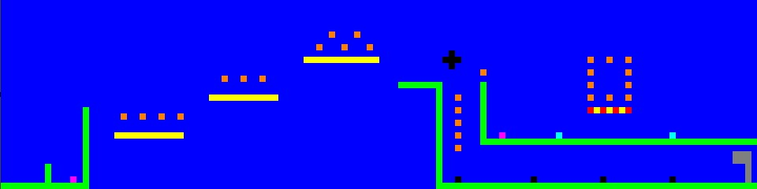
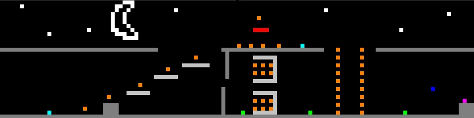
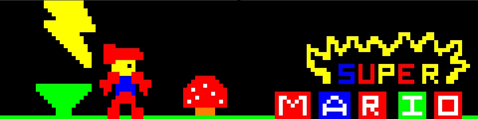

# Super Mario Lightning and Gravity

This project is a Mario-inspired platformer written fully in MASM using the Irvine32 library. The goal was to see how far a complete game loop, physics and interaction can be pushed using only low level assembly code.  
I also added my own spin on the classic idea: Level 1 includes gravity boots that change how jumping feels, and Level 2 introduces a lightning mechanic that affects the player during gameplay.

---

## Screenshots

The images below show the design of the menu and both levels.  
The actual game runs inside the Windows console.

---

## Folder layout

The text files in `levels_and_menu` are used by the game to build platforms and mechanics.

---

## Requirements

You need these to run the game:

- Windows  
- MASM (ML.exe)  
- Irvine32 library installed  

---

## How to run the game

1. Open the `src` folder  
2. Build the file `main.asm` on your own machine  
3. Make sure the `levels_and_menu` folder stays next to `src`  
4. Run the exe you build on your system  

(The actual build command depends on how YOUR system is set up, so users must build it according to their MASM + Irvine32 setup.)

---

## Controls

- W : Jump / Double jump  
- D : Move right  
- A: Jump / Double jump  
- P: Pause Menu  

---

## Notes

This is a learning project for practicing low-level programming in assembly. No high-level constructs like if/while were used; everything is handled through labels and jumps.
